```matlab:Code
clc

clear all
```

Here we show the classification results using SMOTE and Random undersampling as well as SVM vs BiLSTM

The metrics considered are Class specific F-measures, macro average and micro average F-measure, precision, specificity, sensitivity etc. We have also included accuracy even though it may not be a good metric for testing imbalanced dataset. In addition normalized confusion matrix is also provided for analysis.

# **SVM based Classification**

**REM vs Wake**

Model trained using Random Undersampling of Majority class (The models considered here are the best models obtained using hyperparameter optimization)

```matlab:Code

Model = load('C:\courses\ML\project\SVM_2_class\trained_model_SVM_US.mat'); % Model trained with Undersampling
Model = Model.model;
Testing = load('C:\courses\ML\project\SVM_2_class\Testingred_features_SVM_US.mat');
Testing = Testing.testFeatures1;
TestingLabels = load('C:\courses\ML\project\codes\TrainNetworkProject2\dataset_processed\TwoclassTestUSLabels.mat');
TestingLabels = TestingLabels.TwoClassTest_US_Labels';
[label,score] = predict(Model,Testing);
C = confusionmat(TestingLabels,categorical(label));
[stats] = statsOfMeasure(C, 1);
```

| |name|classes}|macroAVG|microAVG| |
|:--:|:--:|:--:|:--:|:--:|:--:|
|1|"true_positive"|2385|716|1.5505e+03|1.5505e+03|
|2|"false_positive"|113|878|495.5000|495.5000|
|3|"false_negative"|878|113|495.5000|495.5000|
|4|"true_negative"|716|2385|1.5505e+03|1.5505e+03|
|5|"precision"|0.9548|0.4492|0.7020|0.7578|
|6|"sensitivity"|0.7309|0.8637|0.7973|0.7578|
|7|"specificity"|0.8637|0.7309|0.7973|0.7578|
|8|"accuracy"|0.7578|0.7578|0.7578|0.7578|
|9|"F-measure"|0.8280|0.5910|0.7095|0.7578|

```matlab:Code
figure
confusionchart(TestingLabels,categorical(label),'Normalization','row-normalized','RowSummary','row-normalized')
```

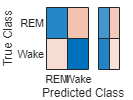

Model trained using SMOTE (The models considered here are the best models obtained using hyperparameter optimization)

```matlab:Code

Model = load('C:\courses\ML\project\SVM_2_class\trained_model_SVM_SMOTE.mat'); % Model trained with Undersampling
Model = Model.model;
Testing = load('C:\courses\ML\project\SVM_2_class\Testingred_features_SVM_SMOTE.mat');
Testing = Testing.testFeatures1;
TestingLabels = load('C:\courses\ML\project\codes\TrainNetworkProject2\dataset_processed\TwoclassTestSMOTELabels.mat');
TestingLabels = TestingLabels.TwoClassTest_SMOTE_Labels';
[label,score] = predict(Model,Testing);
C = confusionmat(TestingLabels,categorical(label));
[stats] = statsOfMeasure(C, 1);
```

| |name|classes}|macroAVG|microAVG| |
|:--:|:--:|:--:|:--:|:--:|:--:|
|1|"true_positive"|2927|605|1766|1766|
|2|"false_positive"|224|336|280|280|
|3|"false_negative"|336|224|280|280|
|4|"true_negative"|605|2927|1766|1766|
|5|"precision"|0.9289|0.6429|0.7859|0.8631|
|6|"sensitivity"|0.8970|0.7298|0.8134|0.8631|
|7|"specificity"|0.7298|0.8970|0.8134|0.8631|
|8|"accuracy"|0.8631|0.8631|0.8631|0.8631|
|9|"F-measure"|0.9127|0.6836|0.7982|0.8631|

```matlab:Code
figure
confusionchart(TestingLabels,categorical(label),'Normalization','row-normalized','RowSummary','row-normalized')
```

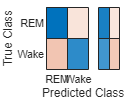

**NREM vs Wake**

Model trained using Random Undersampling of Majority class (The models considered here are the best models obtained using hyperparameter optimization)

```matlab:Code
Model = load('C:\courses\ML\project\SVM_3_class\trained_model_SVM_US.mat'); % Model trained with Undersampling
Model = Model.model;
Testing = load('C:\courses\ML\project\SVM_3_class\Testingred_features_SVM_US.mat');
Testing = Testing.testFeatures1;
TestingLabels = load('C:\courses\ML\project\codes\TrainNetworkProject2\dataset_processed\ThreeclassTestUSLabels.mat');
TestingLabels = TestingLabels.ThreeClassTest_US_Labels';
[label,score] = predict(Model,Testing);
C = confusionmat(TestingLabels,categorical(label));
[stats] = statsOfMeasure(C, 1);
```

| |name|classes}|macroAVG|microAVG| |
|:--:|:--:|:--:|:--:|:--:|:--:|
|1|"true_positive"|13184|716|6950|6950|
|2|"false_positive"|113|2076|1.0945e+03|1.0945e+03|
|3|"false_negative"|2076|113|1.0945e+03|1.0945e+03|
|4|"true_negative"|716|13184|6950|6950|
|5|"precision"|0.9915|0.2564|0.6240|0.8639|
|6|"sensitivity"|0.8640|0.8637|0.8638|0.8639|
|7|"specificity"|0.8637|0.8640|0.8638|0.8639|
|8|"accuracy"|0.8639|0.8639|0.8639|0.8639|
|9|"F-measure"|0.9233|0.3955|0.6594|0.8639|

```matlab:Code
figure
confusionchart(TestingLabels,categorical(label),'Normalization','row-normalized','RowSummary','row-normalized')
```

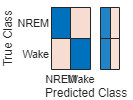

Model trained using SMOTE (The models considered here are the best models obtained using hyperparameter optimization)

```matlab:Code
Model = load('C:\courses\ML\project\SVM_3_class\trained_model_SVM_SMOTE.mat'); % Model trained with SMOTE
Model = Model.model;
Testing = load('C:\courses\ML\project\SVM_3_class\Testingred_features_SVM_SMOTE.mat');
Testing = Testing.testFeatures1;
TestingLabels = load('C:\courses\ML\project\codes\TrainNetworkProject2\dataset_processed\ThreeclassTestSMOTELabels.mat');
TestingLabels = TestingLabels.ThreeClassTest_SMOTE_Labels';
[label,score] = predict(Model,Testing);
C = confusionmat(TestingLabels,categorical(label));
[stats] = statsOfMeasure(C, 1);
```

| |name|classes}|macroAVG|microAVG| |
|:--:|:--:|:--:|:--:|:--:|:--:|
|1|"true_positive"|13780|632|7206|7206|
|2|"false_positive"|197|1480|838.5000|838.5000|
|3|"false_negative"|1480|197|838.5000|838.5000|
|4|"true_negative"|632|13780|7206|7206|
|5|"precision"|0.9859|0.2992|0.6426|0.8958|
|6|"sensitivity"|0.9030|0.7624|0.8327|0.8958|
|7|"specificity"|0.7624|0.9030|0.8327|0.8958|
|8|"accuracy"|0.8958|0.8958|0.8958|0.8958|
|9|"F-measure"|0.9426|0.4298|0.6862|0.8958|

```matlab:Code
figure
confusionchart(TestingLabels,categorical(label),'Normalization','row-normalized','RowSummary','row-normalized')
```

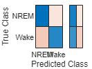

**Five class Classification**

```matlab:Code
Model = load('C:\courses\ML\project\SVM_5_class\AUTOMATEDCODE\trained_model_SVM_US.mat'); % Model trained with Undersampling
Model = Model.model;
Testing = load('C:\courses\ML\project\SVM_5_class\AUTOMATEDCODE\Testingred_features_SVM_US.mat');
Testing = Testing.testFeatures1;
TestingLabels = load('C:\courses\ML\project\codes\TrainNetworkProject2\dataset_processed\FiveclassTestingUSLabels.mat');
TestingLabels = TestingLabels.Class_Testing';
[label,score] = predict(Model,Testing);
C = confusionmat(TestingLabels,categorical(label));
[stats] = statsOfMeasure(C, 1);
```

| |name|classes}|macroAVG|microAVG| | | | |
|:--:|:--:|:--:|:--:|:--:|:--:|:--:|:--:|:--:|
|1|"true_positive"|12|3936|647|267|628|1098|1098|
|2|"false_positive"|2453|2055|5256|565|3533|2.7724e+03|2.7724e+03|
|3|"false_negative"|1362|6077|3226|2996|201|2.7724e+03|2.7724e+03|
|4|"true_negative"|15525|7284|10223|15524|14990|1.2709e+04|1.2709e+04|
|5|"precision"|0.0049|0.6570|0.1096|0.3209|0.1509|0.2487|0.2837|
|6|"sensitivity"|0.0087|0.3931|0.1671|0.0818|0.7575|0.2816|0.2837|
|7|"specificity"|0.8636|0.7800|0.6604|0.9649|0.8093|0.8156|0.8209|
|8|"accuracy"|0.2837|0.2837|0.2837|0.2837|0.2837|0.2837|0.2837|
|9|"F-measure"|0.0063|0.4919|0.1324|0.1304|0.2517|0.2025|0.2837|

```matlab:Code
figure
confusionchart(TestingLabels,categorical(label),'Normalization','row-normalized','RowSummary','row-normalized')
```

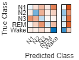

# Bidirectional Long Short Term Memory (BiLSTM) based classification

**REM vs Wake**

Model trained using Random Undersampling of Majority class (The models considered here are the best models obtained using hyperparameter optimization)

```matlab:Code

Model = load('C:\courses\ML\project\codes\TrainNetworkProject2\BiLSTM_fiveclass\hyperparameter_tuning_US_2class\0.22867.mat'); % Best Model trained with Undersampling
Model = Model.netLSTM;
Testing = load('C:\courses\ML\project\codes\TrainNetworkProject2\dataset_processed\TwoclassTestUS.mat');
Testing = Testing.Balancedsleep2ClasstestUSCell;
TestingLabels = load('C:\courses\ML\project\codes\TrainNetworkProject2\dataset_processed\TwoclassTestUSLabels.mat');
TestingLabels = TestingLabels.TwoClassTest_US_Labels';
[label,score] = classify(Model,Testing)
```

```text:Output
label = 4092x1 categorical    
REM          
REM          
REM          
REM          
REM          
REM          
Wake         
Wake         
REM          
REM          

score = 4092x2 single matrix    
    0.9400    0.0600
    0.9822    0.0178
    0.8458    0.1542
    0.9981    0.0019
    0.9988    0.0012
    0.9978    0.0022
    0.0114    0.9886
    0.0762    0.9238
    0.9956    0.0044
    0.9952    0.0048

```

```matlab:Code
C = confusionmat(TestingLabels,categorical(label));
[stats] = statsOfMeasure(C, 1);
```

| |name|classes}|macroAVG|microAVG| |
|:--:|:--:|:--:|:--:|:--:|:--:|
|1|"true_positive"|2835|522|1.6785e+03|1.6785e+03|
|2|"false_positive"|307|428|367.5000|367.5000|
|3|"false_negative"|428|307|367.5000|367.5000|
|4|"true_negative"|522|2835|1.6785e+03|1.6785e+03|
|5|"precision"|0.9023|0.5495|0.7259|0.8204|
|6|"sensitivity"|0.8688|0.6297|0.7493|0.8204|
|7|"specificity"|0.6297|0.8688|0.7493|0.8204|
|8|"accuracy"|0.8204|0.8204|0.8204|0.8204|
|9|"F-measure"|0.8852|0.5868|0.7360|0.8204|

```matlab:Code
figure
confusionchart(TestingLabels,categorical(label),'Normalization','row-normalized','RowSummary','row-normalized')
```

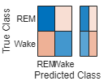

Model trained using SMOTE (The models considered here are the best models obtained using hyperparameter optimization)

```matlab:Code
Model = load('D:\ML\hyperparametertuning_SMOTE_BILSTM_2CLASS\0.22749.mat'); % Best Model trained with SMOTE
```

```text:Output
Warning: While loading an object of class 'nnet.cnn.TrainingOptionsADAM':
'CheckpointFrequency' is not an option for solver 'adam'.
```

```matlab:Code
Model = Model.netLSTM;
Testing = load('C:\courses\ML\project\codes\TrainNetworkProject2\dataset_processed\TwoclassTestSMOTE.mat');
Testing = Testing.Balancedsleep2ClasstestSMOTECell;
TestingLabels = load('C:\courses\ML\project\codes\TrainNetworkProject2\dataset_processed\TwoclassTestSMOTELabels.mat');
TestingLabels = TestingLabels.TwoClassTest_SMOTE_Labels';
[label,score] = classify(Model,Testing)
```

```text:Output
label = 4092x1 categorical    
REM          
REM          
REM          
REM          
REM          
REM          
Wake         
Wake         
REM          
REM          

score = 4092x2 single matrix    
    0.9557    0.0443
    0.9990    0.0010
    0.9346    0.0654
    0.9931    0.0069
    0.9985    0.0015
    0.9686    0.0314
    0.0968    0.9032
    0.0771    0.9229
    0.9849    0.0151
    0.9945    0.0055

```

```matlab:Code
C = confusionmat(TestingLabels,categorical(label));
[stats] = statsOfMeasure(C, 1);
```

| |name|classes}|macroAVG|microAVG| |
|:--:|:--:|:--:|:--:|:--:|:--:|
|1|"true_positive"|3006|505|1.7555e+03|1.7555e+03|
|2|"false_positive"|324|257|290.5000|290.5000|
|3|"false_negative"|257|324|290.5000|290.5000|
|4|"true_negative"|505|3006|1.7555e+03|1.7555e+03|
|5|"precision"|0.9027|0.6627|0.7827|0.8580|
|6|"sensitivity"|0.9212|0.6092|0.7652|0.8580|
|7|"specificity"|0.6092|0.9212|0.7652|0.8580|
|8|"accuracy"|0.8580|0.8580|0.8580|0.8580|
|9|"F-measure"|0.9119|0.6348|0.7733|0.8580|

```matlab:Code
figure
confusionchart(TestingLabels,categorical(label),'Normalization','row-normalized','RowSummary','row-normalized')
```

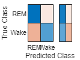

**NREM vs Wake**

Model trained using Random Undersampling of Majority class (The models considered here are the best models obtained using hyperparameter optimization)

```matlab:Code

Model = load('C:\courses\ML\project\codes\TrainNetworkProject2\BiLSTM_fiveclass\Hyperparameter_tuning_US_3Class\0.244.mat'); % Model trained with Undersampling
Model = Model.netLSTM;
Testing = load('C:\courses\ML\project\codes\TrainNetworkProject2\dataset_processed\ThreeclassTestUS.mat');
Testing = Testing.Balancedsleep3ClasstestUSCell;
TestingLabels = load('C:\courses\ML\project\codes\TrainNetworkProject2\dataset_processed\ThreeclassTestUSLabels.mat');
TestingLabels = TestingLabels.ThreeClassTest_US_Labels';
[label,score] = classify(Model,Testing)
```

```text:Output
label = 16089x1 categorical    
NREM         
Wake         
Wake         
Wake         
NREM         
NREM         
NREM         
Wake         
NREM         
Wake         

score = 16089x2 single matrix    
    0.7407    0.2593
    0.0128    0.9872
    0.2245    0.7755
    0.2174    0.7826
    0.7075    0.2925
    0.6582    0.3418
    0.5454    0.4546
    0.4442    0.5558
    0.7784    0.2216
    0.2841    0.7159

```

```matlab:Code
C = confusionmat(TestingLabels,categorical(label));
[stats] = statsOfMeasure(C, 1);
```

| |name|classes}|macroAVG|microAVG| |
|:--:|:--:|:--:|:--:|:--:|:--:|
|1|"true_positive"|13295|493|6894|6894|
|2|"false_positive"|336|1965|1.1505e+03|1.1505e+03|
|3|"false_negative"|1965|336|1.1505e+03|1.1505e+03|
|4|"true_negative"|493|13295|6894|6894|
|5|"precision"|0.9754|0.2006|0.5880|0.8570|
|6|"sensitivity"|0.8712|0.5947|0.7330|0.8570|
|7|"specificity"|0.5947|0.8712|0.7330|0.8570|
|8|"accuracy"|0.8570|0.8570|0.8570|0.8570|
|9|"F-measure"|0.9204|0.3000|0.6102|0.8570|

```matlab:Code
figure
confusionchart(TestingLabels,categorical(label),'Normalization','row-normalized','RowSummary','row-normalized')
```

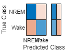

Model trained using SMOTE (The models considered here are the best models obtained using hyperparameter optimization)

```matlab:Code
Model = load('C:\courses\ML\project\codes\TrainNetworkProject2\BiLSTM_fiveclass\Hyperparameter_tuning_SMOTE_3class\0.21382.mat'); % Best Model trained with SMOTE
Model = Model.netLSTM;
Testing = load('C:\courses\ML\project\codes\TrainNetworkProject2\dataset_processed\ThreeclassTestSMOTE.mat');
Testing = Testing.Balancedsleep3ClasstestSMOTECell;
TestingLabels = load('C:\courses\ML\project\codes\TrainNetworkProject2\dataset_processed\ThreeclassTestSMOTELabels.mat');
TestingLabels = TestingLabels.ThreeClassTest_SMOTE_Labels';
[label,score] = classify(Model,Testing)
```

```text:Output
label = 16089x1 categorical    
NREM         
Wake         
NREM         
NREM         
NREM         
NREM         
Wake         
NREM         
NREM         
Wake         

score = 16089x2 single matrix    
    0.7798    0.2202
    0.3349    0.6651
    0.6163    0.3837
    0.6663    0.3337
    0.6256    0.3744
    0.8045    0.1955
    0.1394    0.8606
    0.6510    0.3490
    0.8357    0.1643
    0.3852    0.6148

```

```matlab:Code
C = confusionmat(TestingLabels,categorical(label));
[stats] = statsOfMeasure(C, 1);
```

| |name|classes}|macroAVG|microAVG| |
|:--:|:--:|:--:|:--:|:--:|:--:|
|1|"true_positive"|14366|419|7.3925e+03|7.3925e+03|
|2|"false_positive"|410|894|652|652|
|3|"false_negative"|894|410|652|652|
|4|"true_negative"|419|14366|7.3925e+03|7.3925e+03|
|5|"precision"|0.9723|0.3191|0.6457|0.9190|
|6|"sensitivity"|0.9414|0.5054|0.7234|0.9190|
|7|"specificity"|0.5054|0.9414|0.7234|0.9190|
|8|"accuracy"|0.9190|0.9190|0.9190|0.9190|
|9|"F-measure"|0.9566|0.3912|0.6739|0.9190|

```matlab:Code
figure
confusionchart(TestingLabels,categorical(label),'Normalization','row-normalized','RowSummary','row-normalized')
```

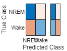

**Five Class classification**

Model trained using Random Undersampling of Majority class (The models considered here are the best models obtained using hyperparameter optimization)

```matlab:Code

Model = load('C:\courses\ML\project\codes\TrainNetworkProject2\BiLSTM_fiveclass\HYPERPARAMETER_TUNING_US_5class\0.5248.mat'); % Model trained with Undersampling
Model = Model.netLSTM;
Testing = load('C:\courses\ML\project\codes\TrainNetworkProject2\dataset_processed\FiveclassTestingUS.mat');
Testing = Testing.BalancedsleepDataTestingCell;
TestingLabels = load('C:\courses\ML\project\codes\TrainNetworkProject2\dataset_processed\FiveclassTestingUSLabels.mat');
TestingLabels = TestingLabels.Class_Testing';
[label,score] = classify(Model,Testing)
```

```text:Output
label = 19352x1 categorical    
Wake         
Wake         
Wake         
N2           
N2           
N3           
Wake         
N2           
N3           
Wake         

score = 19352x5 single matrix    
    0.0295    0.1163    0.1966    0.0041    0.6535
    0.0530    0.0839    0.2921    0.2769    0.2941
    0.1144    0.0664    0.2754    0.0247    0.5191
    0.1395    0.3937    0.2566    0.1097    0.1004
    0.0223    0.4391    0.3134    0.0291    0.1961
    0.0536    0.3070    0.4888    0.0843    0.0663
    0.1298    0.1992    0.0520    0.2576    0.3614
    0.1285    0.4375    0.0928    0.2532    0.0880
    0.1092    0.2144    0.3630    0.1461    0.1673
    0.0882    0.1299    0.0548    0.1778    0.5493

```

```matlab:Code
C = confusionmat(TestingLabels,categorical(label));
[stats] = statsOfMeasure(C, 1);
```

| |name|classes}|macroAVG|microAVG| | | | |
|:--:|:--:|:--:|:--:|:--:|:--:|:--:|:--:|:--:|
|1|"true_positive"|125|3735|3176|1445|309|1758|1758|
|2|"false_positive"|1089|2034|3448|3280|711|2.1124e+03|2.1124e+03|
|3|"false_negative"|1249|6278|697|1818|520|2.1124e+03|2.1124e+03|
|4|"true_negative"|16889|7305|12031|12809|17812|1.3369e+04|1.3369e+04|
|5|"precision"|0.1030|0.6474|0.4795|0.3058|0.3029|0.3677|0.4542|
|6|"sensitivity"|0.0910|0.3730|0.8200|0.4428|0.3727|0.4199|0.4542|
|7|"specificity"|0.9394|0.7822|0.7772|0.7961|0.9616|0.8513|0.8636|
|8|"accuracy"|0.4542|0.4542|0.4542|0.4542|0.4542|0.4542|0.4542|
|9|"F-measure"|0.0966|0.4733|0.6051|0.3618|0.3342|0.3742|0.4542|

```matlab:Code
figure
confusionchart(TestingLabels,categorical(label),'Normalization','row-normalized','RowSummary','row-normalized')
```

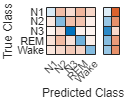

Model trained using SMOTE (The models considered here are the best models obtained using hyperparameter optimization)

```matlab:Code
Model = load('C:\courses\ML\project\codes\TrainNetworkProject2\BiLSTM_fiveclass\trainedModels_hyperparametertuning_SMOTE5CLASS\0.65897.mat'); % Best Model trained with SMOTE
Model = Model.netLSTM;
Testing = load('C:\courses\ML\project\codes\TrainNetworkProject2\dataset_processed\FiveclassTestingSMOTE.mat');
Testing = Testing.BalancedsleepDataTestingSMOTECell;
TestingLabels = load('C:\courses\ML\project\codes\TrainNetworkProject2\dataset_processed\FiveclassTestingSMOTELabels.mat');
TestingLabels = TestingLabels.Class_TestingSMOTE';
[label,score] = classify(Model,Testing)
```

```text:Output
label = 19352x1 categorical    
N1           
N2           
N1           
N2           
N1           
N2           
REM          
N2           
REM          
Wake         

score = 19352x5 single matrix    
    0.6301    0.2694    0.0017    0.0023    0.0965
    0.1846    0.6457    0.0057    0.0949    0.0692
    0.5772    0.2275    0.0625    0.0191    0.1137
    0.2231    0.6506    0.0178    0.0407    0.0679
    0.4869    0.2097    0.0240    0.0076    0.2719
    0.4082    0.4418    0.0015    0.0039    0.1447
    0.0196    0.1478    0.0370    0.4203    0.3754
    0.1025    0.4102    0.1385    0.1919    0.1570
    0.1044    0.2867    0.1724    0.3084    0.1281
    0.0692    0.1869    0.1244    0.1528    0.4667

```

```matlab:Code
C = confusionmat(TestingLabels,categorical(label));
[stats] = statsOfMeasure(C, 1);
```

| |name|classes}|macroAVG|microAVG| | | | |
|:--:|:--:|:--:|:--:|:--:|:--:|:--:|:--:|:--:|
|1|"true_positive"|90|5862|7|1415|309|1.5366e+03|1.5366e+03|
|2|"false_positive"|5245|2635|832|2386|571|2.3338e+03|2.3338e+03|
|3|"false_negative"|1284|4151|3866|1848|520|2.3338e+03|2.3338e+03|
|4|"true_negative"|12733|6704|14647|13703|17952|1.3148e+04|1.3148e+04|
|5|"precision"|0.0169|0.6899|0.0083|0.3723|0.3511|0.2877|0.3970|
|6|"sensitivity"|0.0655|0.5854|0.0018|0.4337|0.3727|0.2918|0.3970|
|7|"specificity"|0.7083|0.7178|0.9462|0.8517|0.9692|0.8386|0.8493|
|8|"accuracy"|0.3970|0.3970|0.3970|0.3970|0.3970|0.3970|0.3970|
|9|"F-measure"|0.0268|0.6334|0.0030|0.4006|0.3616|0.2851|0.3970|

```matlab:Code
figure
confusionchart(TestingLabels,categorical(label),'Normalization','row-normalized','RowSummary','row-normalized')
```

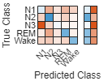
