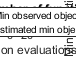

```matlab:Code
clc
clear al1
```

```matlab:Code

```

Load the preprocessed dataset (stored in .mat files). Loaded data will be in the form of "struct" file. Extract the data inside that using dot indexing 

```matlab:Code

Training = load('C:\courses\ML\project\codes\TrainNetworkProject2\dataset_processed\TwoclassTrainUS.mat');
Training = Training.Balancedsleep2ClasstrainUSCell;
TrainingLabels = load('C:\courses\ML\project\codes\TrainNetworkProject2\dataset_processed\TwoclassTrainUSLabels.mat');
TrainingLabels = TrainingLabels.TwoClassTrain_US_Labels';
Validation= load('C:\courses\ML\project\codes\TrainNetworkProject2\dataset_processed\TwoclassValidationUS.mat');
Validation = Validation.Balancedsleep2ClassvalidationUSCell;
ValidationLabels = load('C:\courses\ML\project\codes\TrainNetworkProject2\dataset_processed\TwoclassValidationUSLabels.mat');
ValidationLabels = ValidationLabels.TwoClassValidation_US_Labels';
Testing= load('C:\courses\ML\project\codes\TrainNetworkProject2\dataset_processed\TwoclassTestUS.mat');
Testing = Testing.Balancedsleep2ClasstestUSCell;
TestingLabels = load('C:\courses\ML\project\codes\TrainNetworkProject2\dataset_processed\TwoclassTestUSLabels.mat');
TestingLabels = TestingLabels.TwoClassTest_US_Labels';
```

 Hyperparameter tuning using  Bayesian optimization approach (which is better than grid search and random search since it performs hyperparameter search in an "informed" fashion)

```matlab:Code

optimVars = [
    optimizableVariable('miniBatchSize',[2 128],'Type','integer')
    optimizableVariable('MaxEpochs',[10 60],'Type','integer')
    optimizableVariable('hiddenunits',[1000 3000],'Type','integer')
    optimizableVariable('InitialLearnRate',[1e-6 1e-2],'Transform','log')
      optimizableVariable('L2Regularization',[1e-10 1e-2],'Transform','log')
    optimizableVariable('dropout',[0.1 0.6])
    optimizableVariable('GradientThreshold',[0.1 3])
    optimizableVariable('GradientDecayFactor',[0.7 0.99])
    optimizableVariable('SquaredGradientDecayFactor',[0.7 0.99])];

ObjFcn = makeObjFcn(Training,TrainingLabels,Validation,ValidationLabels);

BayesObject = bayesopt(ObjFcn,optimVars, ...
    'MaxTime',6*60*60, ...
    'IsObjectiveDeterministic',false, ...
    'UseParallel',false);
```

```text:Output
|==============================================================================================================================================================================================================|
| Iter | Eval   | Objective   | Objective   | BestSoFar   | BestSoFar   | miniBatchSize|    MaxEpochs |  hiddenunits | InitialLearn-| L2Regulariza-|      dropout | GradientThre-| GradientDeca-| SquaredGradi-|
|      | result |             | runtime     | (observed)  | (estim.)    |              |              |              | Rate         | tion         |              | shold        | yFactor      | entDecayFact |
|==============================================================================================================================================================================================================|
|    1 | Best   |     0.28133 |      979.62 |     0.28133 |     0.28133 |           96 |           24 |         2664 |   3.6591e-06 |   4.7613e-05 |      0.59375 |      0.91071 |      0.96086 |      0.77011 |
|    2 | Best   |     0.24733 |      352.61 |     0.24733 |     0.24925 |           62 |           16 |         2072 |   4.3486e-05 |   4.8133e-06 |      0.22742 |        1.599 |      0.72983 |      0.94884 |
|    3 | Accept |     0.34667 |      128.99 |     0.24733 |     0.24734 |           82 |           38 |         1058 |    0.0072434 |   6.7492e-06 |      0.11588 |      0.31803 |      0.71802 |      0.77252 |
|    4 | Accept |     0.33533 |      1105.9 |     0.24733 |     0.24734 |           13 |           43 |         1662 |    0.0019963 |   4.1314e-10 |      0.22808 |       2.3978 |      0.82214 |      0.73024 |
|    5 | Accept |     0.29933 |      187.02 |     0.24733 |     0.24734 |           76 |           10 |         1479 |    0.0011748 |    9.049e-05 |       0.1377 |      0.91431 |      0.71287 |      0.88655 |
|    6 | Accept |        0.29 |      2657.5 |     0.24733 |     0.24734 |           49 |           44 |         1805 |   1.1788e-06 |   0.00048119 |      0.12348 |      0.43844 |      0.71022 |      0.97588 |
|    7 | Best   |     0.23467 |      403.36 |     0.23467 |     0.23636 |           95 |           10 |         2581 |   7.6075e-05 |   2.8503e-07 |      0.35822 |       2.3032 |      0.84278 |      0.76643 |
|    8 | Accept |     0.26467 |      354.49 |     0.23467 |     0.23468 |           75 |           10 |         1881 |   0.00011983 |    1.591e-06 |       0.4879 |       2.3709 |      0.86244 |      0.76876 |
|    9 | Accept |       0.242 |      1478.7 |     0.23467 |     0.23469 |           37 |           13 |         2999 |   4.8906e-05 |   9.2119e-05 |      0.53884 |       1.4123 |      0.87815 |      0.82881 |
|   10 | Accept |       0.254 |       443.5 |     0.23467 |      0.2391 |          111 |           10 |         2555 |    3.698e-05 |   1.2724e-07 |      0.49883 |      0.78771 |      0.71441 |      0.72872 |
|   11 | Accept |     0.23867 |      398.72 |     0.23467 |      0.2347 |          123 |           11 |         2905 |   0.00010193 |   1.7076e-05 |      0.12995 |       1.9808 |      0.73502 |      0.83102 |
|   12 | Accept |     0.24733 |      517.64 |     0.23467 |     0.23578 |          106 |           15 |         2847 |   4.7642e-05 |   3.5181e-06 |      0.12273 |        2.997 |      0.82237 |      0.88683 |
|   13 | Accept |     0.25467 |      606.46 |     0.23467 |      0.2357 |           76 |           44 |         2995 |   8.9835e-05 |   1.1605e-10 |      0.20569 |      0.30481 |      0.75001 |      0.88715 |
|   14 | Accept |     0.23667 |      485.96 |     0.23467 |     0.23471 |           91 |           14 |         2917 |   7.5548e-05 |   2.0184e-06 |      0.23407 |      0.25497 |      0.72578 |      0.77889 |
|   15 | Accept |     0.24533 |      1837.5 |     0.23467 |     0.23521 |           17 |           10 |         2731 |   7.8079e-05 |   1.8538e-09 |      0.50562 |      0.56727 |      0.81207 |      0.90122 |
|   16 | Accept |     0.25133 |      241.53 |     0.23467 |     0.23574 |          119 |           44 |         2577 |   7.2897e-05 |   0.00084426 |      0.25192 |      0.10113 |      0.80784 |      0.76063 |
|   17 | Accept |       0.242 |      121.49 |     0.23467 |     0.23583 |          117 |           11 |         1141 |   6.0495e-05 |   3.7271e-10 |      0.25637 |      0.89691 |      0.76064 |      0.93086 |
|   18 | Accept |       0.238 |      233.57 |     0.23467 |     0.23686 |          122 |           11 |         2983 |   7.1915e-05 |   2.6044e-07 |      0.31799 |       2.7776 |      0.81298 |      0.84011 |
|   19 | Accept |     0.24267 |       132.7 |     0.23467 |     0.23482 |          106 |           11 |         1536 |   6.2646e-05 |    0.0032546 |      0.41382 |      0.31811 |      0.85385 |       0.9807 |
|   20 | Accept |     0.30867 |       113.7 |     0.23467 |     0.23656 |          128 |           52 |         1693 |   0.00042962 |   7.4117e-06 |      0.25513 |      0.91974 |      0.98788 |       0.9768 |
|==============================================================================================================================================================================================================|
| Iter | Eval   | Objective   | Objective   | BestSoFar   | BestSoFar   | miniBatchSize|    MaxEpochs |  hiddenunits | InitialLearn-| L2Regulariza-|      dropout | GradientThre-| GradientDeca-| SquaredGradi-|
|      | result |             | runtime     | (observed)  | (estim.)    |              |              |              | Rate         | tion         |              | shold        | yFactor      | entDecayFact |
|==============================================================================================================================================================================================================|
|   21 | Accept |       0.252 |      373.93 |     0.23467 |     0.23627 |           69 |           11 |         2901 |   7.6131e-05 |   1.4766e-09 |      0.16473 |      0.14677 |      0.95205 |      0.82463 |
|   22 | Accept |     0.25467 |      84.226 |     0.23467 |     0.23941 |          116 |           11 |         1043 |   6.9971e-05 |   4.2772e-08 |      0.39229 |        1.291 |      0.74344 |      0.71852 |
|   23 | Accept |     0.23933 |      209.96 |     0.23467 |     0.23675 |          125 |           15 |         2514 |   7.0682e-05 |    0.0023687 |      0.44933 |       1.8109 |       0.7335 |      0.81573 |
|   24 | Accept |     0.24667 |      220.11 |     0.23467 |     0.23876 |          102 |           11 |         2250 |   7.3825e-05 |   1.9538e-08 |      0.19102 |      0.19446 |      0.80472 |      0.76523 |
|   25 | Accept |     0.27133 |      146.32 |     0.23467 |     0.24007 |          121 |           59 |         1028 |   1.9968e-05 |   0.00011047 |      0.42904 |       1.8155 |      0.94116 |      0.83927 |
|   26 | Best   |     0.22867 |      291.27 |     0.22867 |     0.23276 |          122 |           23 |         2784 |   5.3572e-05 |    0.0012238 |      0.40049 |       1.7466 |      0.70831 |      0.97058 |
|   27 | Accept |     0.26533 |      217.44 |     0.22867 |     0.24211 |          106 |           13 |         2383 |   9.7633e-05 |    0.0007165 |      0.34264 |       1.5919 |      0.72884 |       0.9878 |
|   28 | Accept |     0.27667 |      72.761 |     0.22867 |     0.24201 |          127 |           11 |         1149 |   0.00029636 |    0.0032649 |       0.3914 |       1.5769 |      0.79908 |      0.70241 |
|   29 | Accept |     0.43933 |      77.579 |     0.22867 |     0.23757 |          127 |           11 |         1279 |    0.0098668 |    0.0011036 |      0.36797 |      0.18861 |      0.94599 |      0.81294 |
|   30 | Accept |     0.25267 |      262.62 |     0.22867 |     0.24298 |          114 |           15 |         1721 |   2.2933e-05 |   7.6491e-08 |      0.54023 |       2.3933 |      0.76165 |      0.98236 |
```



```text:Output
__________________________________________________________
Optimization completed.
MaxObjectiveEvaluations of 30 reached.
Total function evaluations: 30
Total elapsed time: 14756.8561 seconds
Total objective function evaluation time: 14737.1323

Best observed feasible point:
    miniBatchSize    MaxEpochs    hiddenunits    InitialLearnRate    L2Regularization    dropout    GradientThreshold    GradientDecayFactor    SquaredGradientDecayFactor
    _____________    _________    ___________    ________________    ________________    _______    _________________    ___________________    __________________________

         122            23           2784           5.3572e-05          0.0012238        0.40049         1.7466                0.70831                   0.97058          

Observed objective function value = 0.22867
Estimated objective function value = 0.24324
Function evaluation time = 291.2681

Best estimated feasible point (according to models):
    miniBatchSize    MaxEpochs    hiddenunits    InitialLearnRate    L2Regularization    dropout    GradientThreshold    GradientDecayFactor    SquaredGradientDecayFactor
    _____________    _________    ___________    ________________    ________________    _______    _________________    ___________________    __________________________

         122            11           2983           7.1915e-05          2.6044e-07       0.31799         2.7776                0.81298                   0.84011          

Estimated objective function value = 0.24298
Estimated function evaluation time = 234.3856
```

  

 Support functions

```matlab:Code

```

```matlab:Code
function ObjFcn = makeObjFcn(XTrain,YTrain,XValidation,YValidation)
ObjFcn = @valErrorFun;
    function [valError,cons,fileName] = valErrorFun(optVars)

    numFeatures = size(XTrain{1},1);
numClasses = numel(categories(YTrain));

layers = [
    sequenceInputLayer(numFeatures,'Name','sequence')
    bilstmLayer(optVars.hiddenunits,'OutputMode','last','Name','bilstm')
    dropoutLayer(optVars.dropout,'Name','drop')
    fullyConnectedLayer(numClasses,'Name','fc')
    softmaxLayer('Name','softmax')
    classificationLayer('Name','classification')];
% miniBatchSize = 16;

numObservations = numel(XTrain);
numIterationsPerEpoch = floor(numObservations / optVars.miniBatchSize);

 options = trainingOptions('adam', ...
     'GradientDecayFactor', optVars.GradientDecayFactor, ...
     'SquaredGradientDecayFactor', optVars.SquaredGradientDecayFactor,...
    'MiniBatchSize',optVars.miniBatchSize, ...
    'InitialLearnRate',optVars.InitialLearnRate, ...
    'GradientThreshold',optVars.GradientThreshold, ...
      'Shuffle','every-epoch', ...
        'ValidationData',{XValidation,YValidation}, ...
    'ValidationFrequency',numIterationsPerEpoch, ...
                'L2Regularization',optVars.L2Regularization, ...
                'MaxEpochs', optVars.MaxEpochs, ...
                'ValidationPatience', 5,...
    'Plots','training-progress', ...
    'Verbose',false);

[netLSTM,info] = trainNetwork(XTrain,YTrain,layers,options);
        close(findall(groot,'Tag','NNET_CNN_TRAININGPLOT_UIFIGURE'))

                YPredicted = classify(netLSTM,XValidation);
        valError = 1 - mean(YPredicted == YValidation);

               fileName = num2str(valError) + ".mat";
        save(fileName,'netLSTM','valError','options')
        cons = [];
        
    end
end 

```
